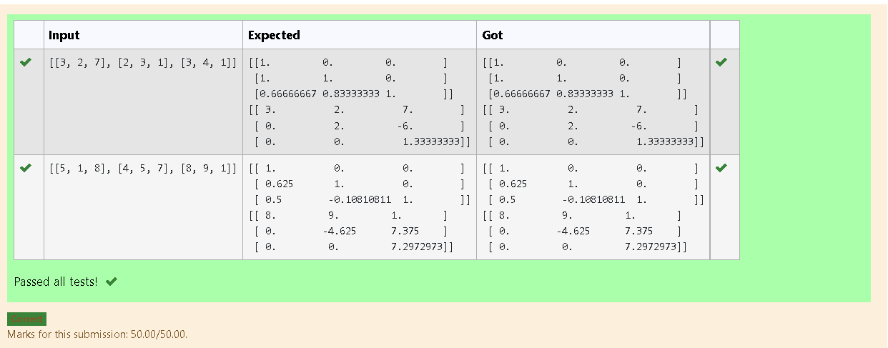
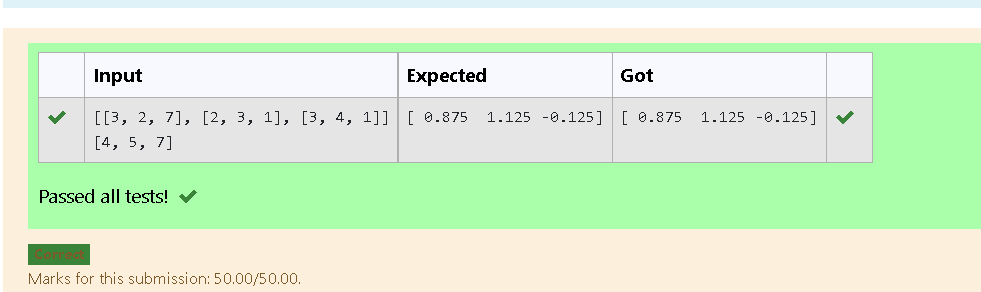

# LU Decomposition without zero on the diagonal

## AIM:
To write a program to find the LU Decomposition of a matrix.

## Equipments Required:
1. Hardware – PCs
2. Anaconda – Python 3.7 Installation / Moodle-Code Runner

## Algorithm
1. import numpy as np and input lu from scipy
2. get the input
3. by using the comand P,L,U=lu() and x= lu_solve((lu_factor(a),b))
4. print the output 

## Program:
```
/*
Program to  LU Decomposition to find L and U matrix..
Developed by:Souvik kundu 
RegisterNumber:21001557 
*/


import numpy as np
from scipy. linalg import lu
A = np.array(eval(input()))
P,L,U=lu(A)
print(L)
print(U)
```

```
/*
Program to  LU Decomposition to solve a matrix..
Developed by:Souvik kundu 
RegisterNumber:21001557 
*/

import numpy as np
from scipy.linalg import lu_factor,lu_solve
a = eval(input())
b = eval(input())
lu,piv = lu_factor(a)
x= lu_solve((lu,piv),b)
print(x)
```

## Output:
Program to  LU Decomposition to find L and U matrix



Program to  LU Decomposition to solve a matrix




## Result:
Thus the program to find the LU Decomposition of a matrix is written and verified using python programming.

